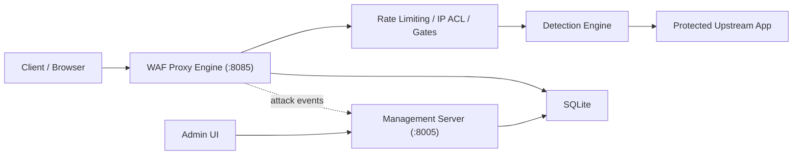
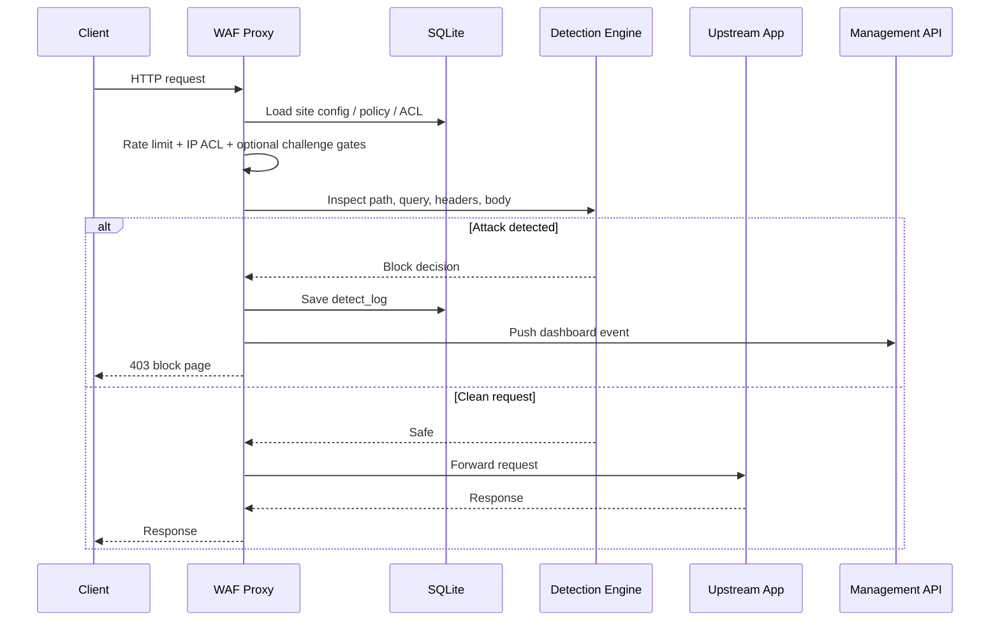

# Digi Save WAF


> A self-hosted reverse-proxy web application firewall built as a final-year cybersecurity project.  
> Digi Save WAF inspects live HTTP traffic, blocks common web attacks, logs forensic evidence, and provides a management dashboard for protected websites.

## Portfolio Snapshot

- Project type: Final-year cybersecurity and full-stack engineering project
- Core idea: Put a WAF proxy in front of a vulnerable or production web app and inspect requests before they hit the real server
- Main stack: FastAPI, Python, SQLite, `httpx`, HTML/CSS/JS, Chart.js
- Security focus: SQLi, XSS, command injection, path traversal, sensitive file access, SSRF, XXE, SSTI, scanner detection, IP ACL, rate limiting, and challenge gates
- Demo model: Includes an intentionally vulnerable local target application for safe demonstrations

## Why This Project Matters

Most student security projects stop at detection or logs. Digi Save WAF goes further:

- runs as a real reverse proxy
- forwards clean traffic to a live upstream application
- blocks malicious requests before they reach the target
- logs attack events for analysis
- gives the administrator a working dashboard, rules panel, protected-site management, and security settings

This makes it a strong portfolio piece because it combines:

- cybersecurity concepts
- networking and reverse-proxy design
- backend API engineering
- frontend dashboard design
- authentication and MFA
- database-backed configuration and logging

## Key Features

- Reverse-proxy WAF engine on port `8085`
- Management server and admin UI on port `8005`
- SQLite-backed configuration, users, rules, and attack logs
- Modular detection engine with 12 attack families
- Per-site protection settings and routing
- Rate limiting and IP allow/block rules
- Local CAPTCHA, auth-gate, and dynamic challenge flows
- Admin authentication with JWT, bcrypt, and TOTP MFA
- Demo target app on port `8090` for safe local testing

## Threat Coverage

| Attack Family | Coverage |
|---|---|
| SQL Injection | Union-based, boolean-style, encoded, and suspicious query patterns |
| Cross-Site Scripting | Script tags, inline handlers, and payload fragments |
| Command Injection | Shell separators, chained commands, and dangerous command patterns |
| Path Traversal | `../`, encoded traversal, and Windows/Linux path abuse |
| SSRF | Internal IPs, localhost targets, and metadata endpoint patterns |
| XXE | Entity declaration and XML abuse indicators |
| SSTI | Template expression payloads |
| Scanner Detection | `sqlmap`, `nikto`, `nmap`, and tool-like fingerprints |
| Sensitive File Access | `.env`, backups, config dumps, and exposed files |
| CRLF / LDAP / XPath | Specialized payload signatures for request abuse |

## Architecture



More detail: [Architecture](docs/ARCHITECTURE.md)

## Request Lifecycle



## Public Repo Note

Visual showcase assets were intentionally removed from this public repository version. The code, architecture, setup flow, demo guide, and validation results remain included.

## Verified Results

Current local verification for this portfolio build includes:

- detection suite passing: `39/39`
- direct vulnerable demo target reachable on `8090`
- clean WAF route reachable on `8085`
- SQL injection blocked with `403`
- XSS blocked with `403`
- sensitive file access blocked with `403`

Detailed evidence: [Results & Validation](docs/RESULTS.md)

## Tech Stack

| Layer | Technology | Purpose |
|---|---|---|
| Backend | Python, FastAPI | Management API and reverse-proxy services |
| Proxying | `httpx`, `StreamingResponse` | Forward requests to upstream applications |
| Detection | Custom Python modules | Attack detection and response decisions |
| Frontend | HTML, CSS, JavaScript | Admin dashboard and settings UI |
| Charts | Chart.js | Dashboard visualizations |
| Auth | JWT, bcrypt, `pyotp`, `qrcode` | Login, MFA, credential protection |
| Database | SQLite | Users, sites, policies, logs, statistics |
| Background tasks | APScheduler | Cleanup and periodic jobs |

## Quick Start

### 1. Install dependencies

```bash
pip install -r requirements.txt
```

### 2. Start the management server

```bash
cd backend
python main.py
```

This starts:

- management UI: `http://localhost:8005`
- WAF proxy: `http://localhost:8085`

### 3. Start the demo target

```bash
cd demo_target
python app.py
```

This starts the intentionally vulnerable sample site on:

- `http://127.0.0.1:8090`

### 4. Default admin login

| Username | Password |
|---|---|
| `admin` | `admin123` |

Change these from `Settings -> Security` before long-term use.

## Safe Demo Flow

1. Open the vulnerable demo app directly on `http://127.0.0.1:8090`
2. Open the protected route on `http://localhost:8085`
3. Trigger a demo attack directly against `8090`
4. Trigger the same attack through `8085`
5. Open `http://localhost:8005/logs` to show the blocked event

Full walkthrough: [Demo Guide](docs/DEMO.md)

## Repository Layout

```text
digi-save-waf/
├── backend/                  # FastAPI management server and WAF engine
├── demo_target/              # Intentionally vulnerable app for safe testing
├── frontend/                 # Static admin UI
├── docs/                     # Architecture, setup, results, and project notes
├── Dockerfile
├── compose.yaml
├── requirements.txt
└── README.md
```

## Documentation Map

- [Architecture](docs/ARCHITECTURE.md)
- [Setup Guide](docs/SETUP.md)
- [Demo Guide](docs/DEMO.md)
- [Results & Validation](docs/RESULTS.md)
- [Case Study](docs/CASE_STUDY.md)
- [Roadmap](docs/ROADMAP.md)
- [Screenshot Gallery](docs/SCREENSHOTS.md)
- [Academic Docs Pack](docs/academic/README.md)
- [Security Policy](SECURITY.md)
- [Code of Conduct](CODE_OF_CONDUCT.md)

## Safety Notice

The `demo_target` application is intentionally vulnerable and exists only for local testing, classroom demonstration, and authorized research. Do not deploy it publicly.

## Acknowledgements

This repository is published as a portfolio-ready academic project for Digi Save WAF.

More detail: [Acknowledgements](ACKNOWLEDGEMENTS.md)
