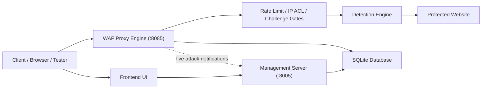
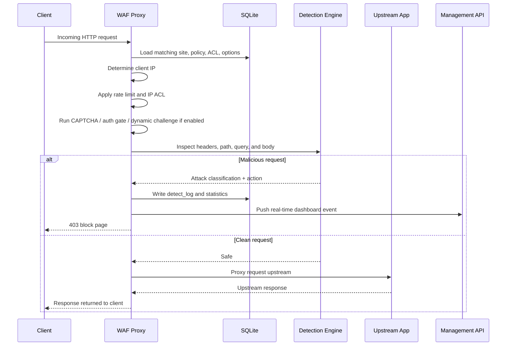

# Architecture

## System Overview

Digi Save WAF uses a two-plane design:

- control plane: admin UI, settings, site management, logs, and rules
- data plane: reverse-proxy traffic inspection and forwarding

This separation keeps the project easy to explain and demonstrates a realistic WAF architecture for an academic environment.

## Component Diagram

## Request Lifecycle

## Main Runtime Components

| File | Responsibility |
|---|---|
| `backend/main.py` | Starts the management server and spawns the WAF proxy engine |
| `backend/waf_engine.py` | Reverse proxy, traffic inspection, gates, logging, forwarding |
| `backend/database.py` | SQLite schema initialization and connection helpers |
| `backend/seed_data.py` | Default admin, demo sites, default policies, seed content |
| `backend/routers/auth.py` | Login, JWT auth, password change, username change, MFA |
| `backend/routers/websites.py` | Protected site CRUD and upstream testing |
| `backend/routers/policy_rules.py` | Custom detection rules and module configuration |
| `backend/routers/detect_logs.py` | Forensic event viewing and export |
| `backend/detection/engine.py` | Orchestrates all detection modules |
| `demo_target/app.py` | Intentionally vulnerable sample app for safe local demonstrations |

## Detection Modules

The detection engine is modular, so each attack family is isolated and easy to extend.

Current modules:

- `sqli`
- `xss`
- `rce`
- `path_traversal`
- `ssrf`
- `ssti`
- `xxe`
- `scanner`
- `sensitive`
- `crlf`
- `ldap`
- `xpath`

## Database Model

SQLite is used as the operational database. That makes the project simple to run, but still demonstrates a realistic configuration and logging system.

Important tables:

- `users`
- `websites`
- `policy_groups`
- `policy_rules`
- `detect_logs`
- `ip_acl`
- `options`
- `system_statistics`
- `captcha_sessions`
- `auth_challenges`
- `geoip_cache`
- `rate_limits`

## Design Strengths

- clear reverse-proxy architecture
- clean separation of admin and traffic paths
- multi-site routing model
- modular detection pipeline
- database-backed configuration and logging
- live demo capability with a real vulnerable target

